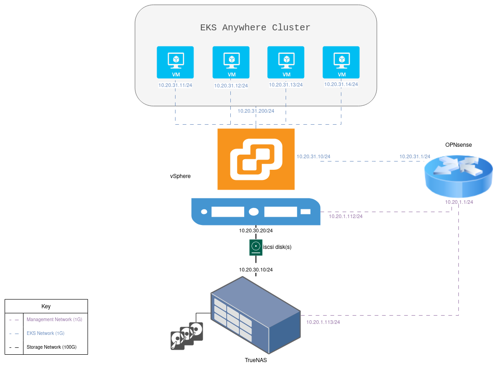

## Kubernetes .. at Home?

While perhaps being a not-so-popular option, I've decided that the best way I could got about hosting the numerous services I'd like to deploy in my own infrastructure is to do that on a [Kubernetes](https://kubernetes.io/) cluster. This approach might not be the go-to for many of us homelabers out there. After all, it adds a lot of friction to the objective of most users. If one's objective is to simply host a network-level caching service, then why not simply install something like [LAN Cache](https://lancache.net/) through [TrueCharts](https://truecharts.org/) or as an [Unraid](https://unraid.net/) app?

Well, my objective is here is *not* to simply host a network-level caching service. Don't get me wrong; we're going to do get to that (any many other services like it) at some point. But that's not my only primary objective. My just-as-primary other objective is to use the same class of tools like I use in my day job as a DevOps Engineer, and learn new ones along the way. Deploying a Kubernetes cluster using enterprise ready tools like [vSphere](https://docs.vmware.com/en/VMware-vSphere/index.html), [EKS Anywhere](https://anywhere.eks.amazonaws.com/) and [Terraform](https://www.terraform.io/) fit my requirements perfectly then.

In previous editions of this blog series, we had already setup the basics of the networking, storage and virtualization stacks of my homelab. In this article, I am going to walk through my journey in going from a vSphere `v8.0.2` environment to having a deployed EKS Anywhere cluster, doing (most of) the work using `terraform`.

## References

- EKS Anywhere [documentation](https://anywhere.eks.amazonaws.com/docs/).
- [Amazon EKS Anywhere on vSphere with Terraform](https://cloudnirman.com/eks-anywhere-with-terraform) blog article by [Ram Pradyumna Rampalli](https://github.com/rpradyr).

## Architecture



## Covering our bases

The first step in tackling a challenging project is to make sure that one is well prepared. For this, we'll be making sure that we adhere to all the requirements for installing EKS on vSphere as specified [here](https://anywhere.eks.amazonaws.com/docs/getting-started/vsphere/vsphere-prereq/).

### Admin machine

Checking the requirements on the [documentation](https://anywhere.eks.amazonaws.com/docs/getting-started/install/), we see that we need to install the following dependencies:

- `eksctl`
- `eksctl-anywhere`
- `kubectl`

### VMware vSphere environment

#### A cluster of clusters

AWS's [documentation](https://anywhere.eks.amazonaws.com/docs/getting-started/vsphere/vsphere-prereq/) on preparing a vSphere environment for EKS Anywhere tells you that you'd need "a vSphere 7+ environment running vCenter". What it doesn't tell you, however (at least in my experience), is that your ESXi hosts in said vSphere environment **need** to be in a compute cluster! In my case, I only have one single machine running ESXi 8.0.2, so I initially hadn't bothered to import it to a cluster. I guess AWS (and VMware) don't really cater for us poor homelabers who want to run EKS in their apartment. How dare they?!

To address this, I attempted to adjust my `terraform` configuration to import my ESXi host into a newly created cluster, but I ran into a new issue. You see, vSphere has a couple of different "modes" of putting ESXi hosts into a compute cluster. You can either choose to have each host manage its own image, or go with centralized management. You can check [here](https://docs.vmware.com/en/VMware-vSphere/7.0/com.vmware.vsphere.vcenterhost.doc/GUID-6A30F824-3702-4580-94A2-C20CA8501547.html) for more details, but the `terraform` [vSphere provider](https://registry.terraform.io/providers/hashicorp/vsphere/latest/docs/resources/compute_cluster) does NOT export this option in its API. This resulted in my existing host refusing to adopt into the cluster I created. I circumvented this problem by creating the cluster (and adding the ESXi host into it) manually from the HTML client, and then imported the configuration into `terraform`. The state file was non the wiser about that attribute and automatically accepted my config. You can find some snippets of my code down below.

```terraform
resource "vsphere_compute_cluster" "prod" {
  name            = "production"
  datacenter_id   = vsphere_datacenter.prod.moid
  host_system_ids = [vsphere_host.esxi01.id]

  drs_enabled          = true
  drs_automation_level = "fullyAutomated"
  dpm_automation_level = "automated"

  ha_enabled = false
  ha_datastore_apd_response = "restartConservative"
  ha_datastore_pdl_response = "restartAggressive"
}
```

```bash
terraform import vsphere_compute_cluster.prod /<----redacted---->/host/production
```

#### Pooling our resources together

Next up, and in an uneventful manner, we create the [vsphere_resource_pool](https://registry.terraform.io/providers/hashicorp/vsphere/latest/docs/resources/resource_pool) and the [vsphere_folder](https://registry.terraform.io/providers/hashicorp/vsphere/latest/docs/resources/folder) using their respective `terraform` resources. As always, remember to reference your `vsphere_datacenter` by using its `moid` (and NOT its `id`).

#### Templating our way through

One of the requirements is to add an OVA template on vSphere so that the cluster's nodes can be created using it. The [Terraform Provider for VMware vSphere](https://registry.terraform.io/providers/hashicorp/vsphere/latest/docs) does have a [vsphere_ovf_vm_template](https://registry.terraform.io/providers/hashicorp/vsphere/latest/docs/data-sources/ovf_vm_template) **data** object, but not a **resource** one. Nevertheless, I tried to use it to import the [Bottlerocket OVA template](https://anywhere.eks.amazonaws.com/docs/getting-started/vsphere/customize/vsphere-ovas/) provided by AWS, but naturally nothing was reflected on the actual vSphere environment. This is because **data** objects in `terraform` are used to *read* existing resources into the state file, and not to create new ones onto the infrastructure. I have thus opened an [issue](https://github.com/hashicorp/terraform-provider-vsphere/issues/2114) on the provider's  Github repo, and proceeded to create the resource using the vSphere HTML client as a workaround.

#### One-upping AWS

Remember that EKS Anywhere on vSphere is a custom solution for Kubernetes, and so it comes with all the bells and whistles of k8s. This includes, amongst other things, cluster-autoscaling, CNI setup for custom network policies, and CSI-related APIs for allocating backing storage for PVs. This would require the cluster's control-plane to automatically configure certain infrastructure-level resources through, you guessed it, the vSphere API! To achieve this, and as per AWS's [documentation](https://anywhere.eks.amazonaws.com/docs/getting-started/vsphere/vsphere-preparation/), we are going to create a user in vSphere so that the EKS control plane can provision such resources using the vSphere API.

AWS wants us to use its own CLI (`eksctl anywhere`) to create the aforementioned user (alongside customizing their roles and permissions), but we are going to do one better. We'll create the required entities using `terraform`! If you'd like to follow along, we are essentially going to map the [govc](https://github.com/vmware/govmomi/tree/main/govc) commands [here](https://anywhere.eks.amazonaws.com/docs/getting-started/vsphere/vsphere-preparation/#configure-via-govc) to their corresponding `terraform` snippets.

For reference, note that VMware follows a **User**(**Group**)-has-the-**Permissions**-of-**Role**-at-**Resource**-level RBAC model.

Creating the `EKSAGlobalRole`, `EKSAUserRole` and `EKSACloudAdminRole` roles were straightforward enough (once you know how to find the required permissions).

```terraform
resource "vsphere_role" "eksa_global" {
  name            = "EKSAGlobalRole"
  role_privileges = [
    ...
  ]
}
resource "vsphere_role" "eksa_user" {
  name            = "EKSAUserRole"
  role_privileges = [
    ...
  ]
}
resource "vsphere_role" "eksa_admin" {
  name            = "EKSACloudAdminRole"
  role_privileges = [
    ...
  ]
}
```

One thing that threw me a bit off-guard was that the vSphere API refused to create the three `System`-related privileges / permissions (`System.Anonymous`, `System.Read`, `System.View`), and `terraform` would attempt every time to add them to the `vsphere_role`'s privileges. However, according to this [forum post](https://communities.vmware.com/t5/VMware-PowerCLI-Discussions/How-to-set-system-view-and-system-anonymous/td-p/2406706), it appears that the `System` privileges namespace is NOT exposed via vCenter. However, all roles (both built-in and custom) would have all 3 `System`-related privileges added by default. Accordingly, I removed them from my `terraform` config.

Creating the user itself isn't as straightforward, though, as the `terraform` provider still doesn't support this feature (as of time of writing). We'll be closely watching this draft [PR](https://github.com/hashicorp/terraform-provider-vsphere/pull/2054) that should eventually add it, but for now we'll use this alternative govc command to create the user.

```bash
govc sso.user.create \
  -d="EKSA User" \
  -f="EKSA" \
  -l="User" \
```

Finally, we can grant the created user the needed permissions. Most of the permissions needed are straightforward to create using the `vsphere-terraform-provider`. One would only need to figure out the correct `entity_type` to set. The developer documentation of the vSphere API [here](https://developer.vmware.com/apis/1720/vsphere/) proved to be extra useful in this regard.

```terraform
resource "vsphere_entity_permissions" "eksa_user_ResourcePool" {
  entity_id   = vsphere_resource_pool.eksa.id
  entity_type = "ResourcePool"

  permissions {
    user_or_group = "${upper(var.vsphere_domain)}\\${local.eksa_user}"
    role_id       = vsphere_role.eksa_user.id
    is_group      = false
    propagate     = true
  }
}
```

One caveat though is that the vSphere API doesn't expose a mechanism to assign a role at the root (i.e.: entire vCenter instance) level, which EKS Anywhere seems to need. We are going to follow AWS's [recommendation](https://anywhere.eks.amazonaws.com/docs/getting-started/vsphere/vsphere-preparation/#manually-set-global-permissions-role-in-global-permissions-ui) of adding such permission using the HTML client. We'll of course also leave a note to out future selves inside the terraform configuration of this manual step.

```terraform

```

## Installation

With all preparations, we are *finally* ready to actually create the cluster! Following the guidelines of AWS's documentation, we generate the YAML-formatted configuration using the following command:

```bash
eksctl anywhere generate clusterconfig \
  $CLUSTER_NAME \
  --provider vsphere \
  > eksa-mgmt-cluster.yaml
```

### There IS such a thing as being *too* descriptive

At the encouragement of the docs, I proceeded to edit the `eksa-mgmt-cluster.yaml` file, referring to [here](https://anywhere.eks.amazonaws.com/docs/getting-started/vsphere/vsphere-spec/) and [here](https://anywhere.eks.amazonaws.com/docs/getting-started/optional/). Little did I know, however, that one "small" edit was going to cost me days of debugging!

While being none the wiser, I initially named this cluster `nyrvama-cai02-prod-eksa-mgmt-cluster`, trying to be as descriptive as possible. I forgot / overlooked, however, that:

1. EKS (and probably other Kubernetes distributions as well) adds a `Label` entry to all `Node` objects with the value of the `Label` being the name of the NodeGroup that this `Node` belongs to.
     - This `Label` is extremely helpful in certain administrative tasks including cluster upgrades / autoscaling.
2. Kubernetes has long since imposed a [limitation](https://kubernetes.io/docs/concepts/overview/working-with-objects/names/#rfc-1035-label-names) such that `Label` values (amongst other) MUST contain at most 63 characters. This is in adherence to [RFC 1035](https://datatracker.ietf.org/doc/html/rfc1035).
3. `eksctl anywhere` is going to use the names of the `Cluster` and `VSphereMachineConfig` objects created to generate from it the name of the corresponding NodeGroup(s), **by appending a postfix string**.

I'm pretty sure that the avid reader would have caught on on what actually happened, then; `eksctl anywhere` named my NodeGroup **`nyrvama-cai02-prod-eksa-mgmt-cluster`**`-eks-a-cluster-control-plane`, which amazingly (and probably both likely *and* unlikely) is 64 characters in length! This caused the creation of the `kind` bootstrapping cluster to fail with the following (truncated) error messages:

```bash
[apiclient] All control plane components are healthy after 22.003180 seconds
[upload-config] Storing the configuration used in ConfigMap "kubeadm-config" in the "kube-system" Namespace

...

I0115 20:11:27.767218     147 uploadconfig.go:131] [upload-config] Preserving the CRISocket information for the control-plane node
I0115 20:11:27.767232     147 patchnode.go:31] [patchnode] Uploading the CRI Socket information "unix:///run/containerd/containerd.sock" to the Node API object "nyrvama-cai02-prod-eksa-mgmt-cluster-eks-a-cluster-control-plane" as an annotation

...

I0115 20:13:27.771568     147 round_trippers.go:553] GET https://nyrvama-cai02-prod-eksa-mgmt-cluster-eks-a-cluster-control-plane:6443/api/v1/nodes/nyrvama-cai02-prod-eksa-mgmt-cluster-eks-a-cluster-control-plane?timeout=10s 404 Not Found in 2 milliseconds
I0115 20:13:27.775214     147 round_trippers.go:553] GET https://nyrvama-cai02-prod-eksa-mgmt-cluster-eks-a-cluster-control-plane:6443/api/v1/nodes/nyrvama-cai02-prod-eksa-mgmt-cluster-eks-a-cluster-control-plane?timeout=10s 404 Not Found in 2 milliseconds

...

nodes "nyrvama-cai02-prod-eksa-mgmt-cluster-eks-a-cluster-control-plane" not found
Error writing Crisocket information for the control-plane node
```

Surprisingly, and even in the most round-about of ways, it's still DNS. "It's always DNS".

After all, hindsight is 20-20. "In-the-moment-sight", sadly, is not. I spent a couple of days chasing dead trails, including:

- the initially-promising yet utimately-fruitless discussions at [this](https://github.com/aws/eks-anywhere/issues/5475) Github issue,
- some power-interrupted `apt upgrade` for my local PC (aren't those always fun?), and even
- a decision to implement the [Admin Machine](https://anywhere.eks.amazonaws.com/docs/getting-started/install/) using a [Vagrant box](https://developer.hashicorp.com/vagrant/docs/boxes) running Ubuntu 22.04 for the ease of mind of having a fresh environment.

Once the epiphany came when I noticed the second-to-last line of the above logs, the rest of the pieces fell into place accordingly. A simple name rename later, and we're back on track.

Of course, and as a good open source citizen, I filed this [bug report](https://github.com/aws/eks-anywhere/issues/7302) with [EKS Anywhere](https://github.com/aws/eks-anywhere), both to document my experience for the next passer-by user, *and* also in an effort to have the log messages be improved and perhaps even the `Cluster` object's name be actively validated by `eksctl anywhere`. Who knows; perhaps one of the next articles may be documenting my experience in addressing this issue?

### Reassuringly uneventful conclusion

Well; almost. We *almost* had an uneventful install. Of course, I had forgot to adjust the firewall rules on the VLAN that the cluster's VMs were being installed to (as I default to denying all traffic). Some OPNsense rules lightening later and the installation completes successfully.

After too many long nights, we finally reach that promised output full of green check marks!

```bash
$ eksctl anywhere create cluster -f eksa-mgmt-cluster.yaml
Warning: The recommended size of an external etcd cluster is 3 or 5
Warning: VSphereDatacenterConfig configured in insecure mode
Warning: The recommended size of an external etcd cluster is 3 or 5
Performing setup and validations
Warning: VSphereDatacenterConfig configured in insecure mode
✅ Connected to server
✅ Authenticated to vSphere
✅ Datacenter validated
✅ Network validated
✅ Datastore validated
✅ Folder validated
✅ Resource pool validated
✅ Datastore validated
✅ Folder validated
✅ Resource pool validated
✅ Datastore validated
✅ Folder validated
✅ Resource pool validated
✅ Machine config tags validated
✅ Control plane and Workload templates validated
✅ eksa@vsphere.cai02.nyrvama.com user vSphere privileges validated
✅ Vsphere Provider setup is valid
✅ Validate OS is compatible with registry mirror configuration
✅ Validate certificate for registry mirror
✅ Validate authentication for git provider
✅ Validate cluster's eksaVersion matches EKS-A version
Creating new bootstrap cluster
Provider specific pre-capi-install-setup on bootstrap cluster
Installing cluster-api providers on bootstrap cluster
Provider specific post-setup
Creating new workload cluster
Installing networking on workload cluster
Creating EKS-A namespace
Installing cluster-api providers on workload cluster
Installing EKS-A secrets on workload cluster
Installing resources on management cluster
Moving cluster management from bootstrap to workload cluster
Installing EKS-A custom components (CRD and controller) on workload cluster
Installing EKS-D components on workload cluster
Creating EKS-A CRDs instances on workload cluster
Installing GitOps Toolkit on workload cluster
GitOps field not specified, bootstrap flux skipped
Writing cluster config file
Deleting bootstrap cluster
🎉 Cluster created!
--------------------------------------------------------------------------------------
The Amazon EKS Anywhere Curated Packages are only available to customers with the 
Amazon EKS Anywhere Enterprise Subscription
--------------------------------------------------------------------------------------
Enabling curated packages on the cluster
Installing helm chart on cluster        {"chart": "eks-anywhere-packages", "version": "0.3.13-eks-a-56"}
```

Adjusting our `KUBECONFIG` to use the newly generated file, we are finally able to interact with our first EKS at Home cluster.

```bash
$ kubectl get nodes
NAME                                 STATUS   ROLES           AGE     VERSION
nyrvama-prod-mgmt-cznhp              Ready    control-plane   17m     v1.28.1-eks-f0272c7
nyrvama-prod-mgmt-j2tgs              Ready    control-plane   20m     v1.28.1-eks-f0272c7
nyrvama-prod-mgmt-md-0-qbw4v-cwk5m   Ready    <none>          13m     v1.28.1-eks-f0272c7
```

## Recap and next steps

In this article we went through the process of installing EKS Anywhere (a Kubernetes distribution developed by AWS) on a vSphere `v8.0.2` environment. This required registering our ESXi host to a vSphere compute cluster, creating multiple vSphere roles (alongside the corresponding privileges), and assigning a newly created user that the EKS control plane will use to communicate with the vSphere API those roles at different levels of the vSphere inventory. We finally created the bootstrapping `kind` cluster (after some long debugging sessions) and deploying the EKS cluster on vSphere. We even opened a couple of Github issues along the way to document the challenges we faced.

**HLaC Score**: 4/5 (Most of the setup is implemented using IaC tools. Manual steps are minimal and/or are being actively worked on in the community to be automated)

Our EKS At Home cluster is not yet ready for deploying applications, however. We still don't have a metrics server installed (as EKS distribution [don't come bundled with one](https://docs.aws.amazon.com/eks/latest/userguide/metrics-server.html) by default). No [StorageClass](https://kubernetes.io/docs/concepts/storage/storage-classes/) is available for stateful applications to use for provisioning [PersistentVolumes](https://kubernetes.io/docs/concepts/storage/persistent-volumes/) either. In the next article, we're going to tackle those (and probably other) cluster administrative tasks. Stay tuned; it's going to be one exciting ride.
