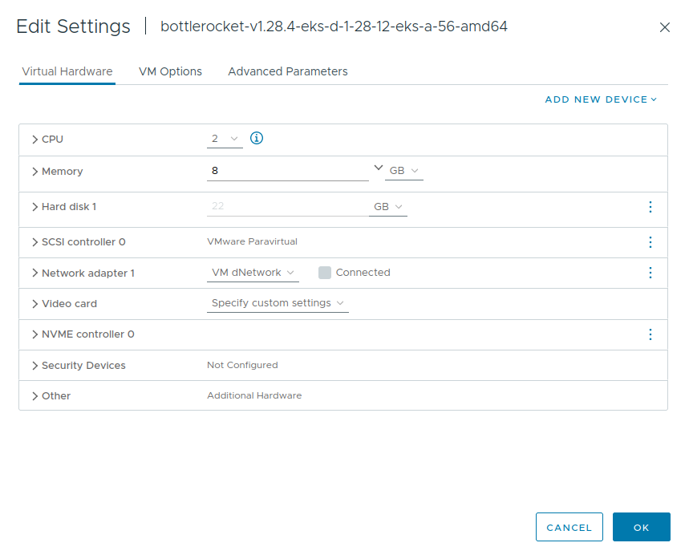

## References

- https://www.domstamand.com/installing-a-kubernetes-cluster-on-vmware-vsphere-and-what-ive-learned/

## Fluxing things very quickly

For a sane and automated EKS at Home installation, we need to make sure that we maintain both the cluster's lifecycle **and** its installed applications using automation tools. Remember that (at least for now) we are using our one `nyrvama-prod-mgmt` cluster as both a management cluster and a workload cluster. I imagine that separating those two concerns is going to be quite an undertaking.

### Two sides of very different coins

And it seems that the EKS Anywhere maintainers and community as large face the same challenge. For example, EKS Anywhere supports managing the Management cluster using tools like [Flux](https://anywhere.eks.amazonaws.com/docs/clustermgmt/cluster-flux/) and [Terraform](https://anywhere.eks.amazonaws.com/docs/clustermgmt/cluster-terraform/). However, one should take care that this only goes to managing the lifecycle of the **cluster(s)** themselves, and not to the applications installed in them. In this [issue](https://github.com/aws/eks-anywhere/issues/3468), Github user [echelOn](https://github.com/echel0n) seemed to have been in the same boat before me and outlined his struggle with attempting to manage their applications on an EKS Anywhere cluster using the EKS Anywhere Flux integration. We could quote probably quote [jiayiwang7](https://github.com/jiayiwang7) in this [thread](https://github.com/aws/eks-anywhere/issues/3468#issuecomment-1262996027) to offer an encompassing summary:

> Flux is installed in EKS-A management cluster to help manage its workload clusters lifecycle: creating, upgrading, deleting workload clusters, NOT really for deploying user applications on workload clusters.

Of course, I hadn't stumbled onto that issue randomly. No no; I only found it after attempting to do exactly what the conclusion of the above discussion deemed a not supported configuration; i.e. attempt to use EKS Anywhere's Flux integration to **both** manage the cluster's lifecycle **and** install different applications onto it following the best principles of GitOps.

### A wrong road leads to a right destination

Let's take the journey from the beginning then. Following the [Manage with GitOps](https://anywhere.eks.amazonaws.com/docs/clustermgmt/cluster-flux/) article at EKS Anywhere's documentation was straightforward enough. Well, at least until it asked me to create a [(classic) Github Personal Access Token](https://docs.github.com/en/authentication/keeping-your-account-and-data-secure/managing-your-personal-access-tokens#personal-access-tokens-classic). You see, those old-style tokens have a couple of grave security limitations:

  1. They are allowed to be created with no expiration date
  2. They give equal access to ALL repos that their owner (i.e.: myself) has access to (subject to the token's configured permissions).

We can (sort of) workaround the first point, but not the second. Remember that Flux stores the PAT as a Kubernetes secret in its `flux-system` namespace indefinitely. For a good night's sleep, I didn't want to create a "one token to rule them all" that would practically have unlimited access to my entire Github presence.

Enter [Fine-grained personal access tokens](https://github.blog/2022-10-18-introducing-fine-grained-personal-access-tokens-for-github/). These new tokens were released in late 2022 and allow their owner to not only select the exact actions permissible via the Github HTTPS API, but also to scope such access down to one or more repositories. Seems promising enough!

However, even after configuring the permissions for my new Fine-grained PAT and scoping them to my infrastructure's repo, `eksctl anywhere` continued to complain that the supplied token doesn't have enough "repo permissions". At some point I even tried giving the Fine-grained PAT read-write permissions to all available scopes for ALL repos; to no avail. Doing some outdated checks, aren't we `eksctl anywhere`? Anyways, perhaps someone would shed the light on this point in the new [issue](https://github.com/aws/eks-anywhere/issues/7360) I opened to discuss Fine-grained PATs with EKS Anywhere.

### The egg came before the chicken

It was at this point that I found the discussions mentioned above relating to EKS Anywhere's Flux integration being intended for managing the lifecycle of the clusters (and their node groups), and NOT the applications deployed on those clusters. It then became apparent that the most maintainable approach here would be to approach those two problems separately. The following was my rationale behind choosing to tackle the **second** task (that of the applications) first:

1. I already have the `nyrvama-prod-mgmt` cluster deployed.
2. The currently deployed cluster will pull double duty as both the management cluster and the workload cluster (at least for the foreseeable future)
3. There is no immediate need to do any management-related operations on the cluster.
4. There is a lot of immediate need to install different components and applications on the cluster.

And of course, what a better way to manage the cluster's deployments than [Flux](https://fluxcd.io/)? And this time, we're doing it the "standard" way by treating our EKS at Home cluster like any vanilla Kubernetes cluster and using a standard `flux bootstrap` invocation.

> **Pro Tip**
>
> If you use VScode, make sure to install [GitOps Tools for Flux](https://marketplace.visualstudio.com/items?itemName=Weaveworks.vscode-gitops-tools) extension. Amongst other features, it will provide auto-completion for Flux's CRDs in your YAML manifests.
>
> If you are not using VScode, then consider using it :). In the alternative, I'm sure you can find an equivalent or alternative integration in your IDE environment.

Well; *almost* standard. I did try my luck with using a Fine-grained personal access token. Surprise, surprise; it worked without a hitch.

For reference, here are the permissions I gave the token. Full disclosure, I'm not sure whether those are the *bare minimum* required or if it is possible to constrain the token further. This seemed good enough for now, especially that I also only scoped the token to the single `nyrvama/nyrvama` repository.

```yaml
Commit statuses: Read-only
Contents: Read and write
Deployments: Read-only
Metadata: Read-only
```

Running `flux bootstrap` to install Flux onto the cluster worked without a problem. Of course, we won't count forgetting to set `KUBECONFIG` to the correct path as a problem :).

```bash
$ flux bootstrap github \
    --token-auth \
    --owner=nyrvama \
    --repository=nyrvama \
    --branch=main \
    --path=clusters/nyrvama-prod-mgmt/nyrvama-prod-mgmt \
    --interval=10m

► connecting to github.com
► cloning branch "main" from Git repository "https://github.com/nyrvama/nyrvama.git"
✔ cloned repository
► generating component manifests
✔ generated component manifests
✔ committed sync manifests to "main" ("c0cce5462ed4c8c5ddfe9a59c3c3ed674d3ee459")
► pushing component manifests to "https://github.com/nyrvama/nyrvama.git"
► installing components in "flux-system" namespace
✔ installed components
✔ reconciled components
► determining if source secret "flux-system/flux-system" exists
► generating source secret
► applying source secret "flux-system/flux-system"
✔ reconciled source secret
► generating sync manifests
✔ generated sync manifests
✔ committed sync manifests to "main" ("a97937ff2881d22595f16346bebc2d67167ba889")
► pushing sync manifests to "https://github.com/nyrvama/nyrvama.git"
► applying sync manifests
✔ reconciled sync configuration
◎ waiting for Kustomization "flux-system/flux-system" to be reconciled
✔ Kustomization reconciled successfully
► confirming components are healthy
✔ helm-controller: deployment ready
✔ kustomize-controller: deployment ready
✔ notification-controller: deployment ready
✔ source-controller: deployment ready
✔ all components are healthy
```

Pulling down the changes that Flux pushed into our repo, we can now see that it has successfully installed its components in the correct and expected directories.

```bash
├── clusters
│   └── nyrvama-prod-mgmt
│       └── nyrvama-prod-mgmt
│           ├── eksa-system
│           │   ├── eksa-cluster.yaml
│           │   └── kustomization.yaml
│           ├── flux-system
│           │   ├── gotk-components.yaml
│           │   ├── gotk-sync.yaml
│           │   └── kustomization.yaml
│           └── Vagrantfile
```

## Every cluster has certain storage needs

Setting up our EKS at Home cluster with an appropriate StorageClass will be paramount to our ability of deploying stateful applications. There are a multitude of different approaches we can take; including [Longhorn](https://longhorn.io), [NFS](https://kubernetes.io/docs/concepts/storage/storage-classes/#nfs), and [vSphere](https://docs.vmware.com/en/VMware-vSphere-Container-Storage-Plug-in/index.html). Of course there are others, but the above were my shortlist.

To go along and choose which provisioner makes sense for our use-case, we need to flesh out our requirements. Those include:

1. Support for high-performance workloads, including running databases, object storage and even ELK stack.
2. Backing by remote storage (TrueNAS or other dedicated hardware) for separation of concerns and ease of expandability.
3. Volume-level management for snapshots, backups and recovery.

The more I considered those requirements, the more I leaned towards primarily using vSphere provider for in-cluster storage. Here's why:

- While I can create virtual disks on vSphere (backed by TrueNAS ISCSi drives) and attach those to the cluster's VMs, it would be redundant to then replicate the volumes across the nodes like Longhorn does. After all, there is enough redundancy on the NAS/SAN level to accommodate that.
- I could also create (multiple) NFS shares (each for a different [PersistentVolume](https://kubernetes.io/docs/concepts/storage/persistent-volumes/)) on my TrueNAS system and have the different nodes mount their needed shares accordingly. This would have satisfied points 2 and 3, but not 1. It is well known that running database servers off of NFS shares is a configuration asking for trouble.
- Using the vSphere provider strikes a nice balance between performance and management overhead. Disks mounted to the virtual machines can themselves be backed by local physical disks, NFS shares, ISCSi drives or even vSAN arrays. Additionally, one could utilize the backup and snapshot features of vSphere for the different disks that represent the different PersistentVolumes.

Of we go then; we have another date with our vCenter server.

We are going to follow the guidelines outlined by [VMware vSphere Container Storage Plug-in](https://docs.vmware.com/en/VMware-vSphere-Container-Storage-Plug-in/3.0/vmware-vsphere-csp-getting-started/GUID-6DBD2645-FFCF-4076-80BE-AD44D7141521.html) documentation. This will include creating a new user for the plugin (alongside needed roles and privileges), creating a Kubernetes Secret for the vSphere user, and then finally actually installing the CSI driver.

### May I have some more (roles) please?

Creating the required roles (as specified [here](https://docs.vmware.com/en/VMware-vSphere-Container-Storage-Plug-in/3.0/vmware-vsphere-csp-getting-started/GUID-0AB6E692-AA47-4B6A-8CEA-38B754E16567.html#GUID-043ACF65-9E0B-475C-A507-BBBE2579AA58__GUID-E51466CB-F1EA-4AD7-A541-F22CDC6DE881)) was again straightforward enough to do in `terraform`. For example, here's the definition for the CNS-Datastore role.

```terraform
resource "vsphere_role" "cns_datastore" {
  name = "CNSDatastoreRole"
  role_privileges = [
    "Datastore.FileManagement",
  ]
}
```

Note that the `Read-only` role is a default (built-in) one, so we actually just need to use a `data` object in terraform to read it into our state file.

```terraform
data "vsphere_role" "read_only" {
  label = "Read-only"
}
```

### Mi *scusi*; un controllore per favore

Our next item of business is to prepare our cluster's nodes for eventually attaching the different virtual disks that are going to represent the PersistentVolumes claimed by the Pods running on them. Following the vSphere's documentation [here](https://docs.vmware.com/en/VMware-vSphere-Container-Storage-Plug-in/3.0/vmware-vsphere-csp-getting-started/GUID-0AB6E692-AA47-4B6A-8CEA-38B754E16567.html#GUID-043ACF65-9E0B-475C-A507-BBBE2579AA58__GUID-E51466CB-F1EA-4AD7-A541-F22CDC6DE881), this boils down to the following 3 steps:

1. Enabling the `disk.EnableUUID` flag
2. Upgrading the VM hardware version to 15 or higher
3. Adding a VMware Paravirtual SCSI storage controller

As our cluster's nodes were created automatically using `eksctl anywhere`, it is a good idea to check if AWS already took care of this configuration for us.

1. [X] To check whether our VMs have `disk.EnableUUID` flag set or not, we can use `govc` CLI

    ```bash
    $ govc vm.info \
        -json \
        /cai02.nyrvama.com/vm/EKSA/* \
        | jq \
        -r '.virtualMachines[].config.extraConfig[] | select(.key=="disk.enableUUID")'

    {
        "key": "disk.enableUUID",
        "value": "TRUE"
    }
    {
        "key": "disk.enableUUID",
        "value": "TRUE"
    }
    {
        "key": "disk.enableUUID",
        "value": "TRUE"
    }
    {
        "key": "disk.enableUUID",
        "value": "TRUE"
    }
    ```

2. [x] Checking for the compatibility is also easy enough

    ```bash
    $ govc vm.info \
        -json \
        /cai02.nyrvama.com/vm/EKSA/* \
        | jq \
        -r '.virtualMachines[].guest.hwVersion'

    vmx-15
    vmx-15
    vmx-15
    vmx-15
    ```

3. [ ] We can also use `govc` to check for the existence of the SCSI controller

    ```bash
    $ govc vm.info \
        -json \
        /cai02.nyrvama.com/vm/EKSA/* \
        | jq \
        -r '.virtualMachines[].config.hardware.device[] | select(.deviceInfo.label=="SCSI controller 0")'
    ```

We're 2 out of 3 then. No worries, let's address this!

Well actually; it isn't super clear on *how* to address this. Obviously, we can easily log onto the vSphere console and a few clicks later we would have our SCSI controller added to the cluster's VMs. But do we want to do it that way? Ths answer is probably no. For one, this would not be sticking to the ethos of this series (it is called HomelabAs**Code** after all). Even if we acknowledge this a limitation of the current tools we are using (`eksctl anywhere` and `terraform`), this is NOT a one-off task. For each new (worker) node added to the cluster, we would have to remember to go ahead and implement this workaround for it. This would definitely remove any hope for us to have the [Cluster Autoscaler](https://anywhere.eks.amazonaws.com/docs/packages/cluster-autoscaler/addclauto/) functioning, for example.

Another possibility is to simply `terraform import` the virtual machines into our state file as [vsphere_virtual_machine](https://registry.terraform.io/providers/hashicorp/vsphere/latest/docs/resources/virtual_machine) objects and then use the [scsi_type](https://registry.terraform.io/providers/hashicorp/vsphere/latest/docs/resources/virtual_machine#scsi_type) attribute to instruct the API to add a SCSI device to the VM. However, this would also not go well with dynamic autoscaling of nodes. Back to the drawing board.

One interesting approach is to modify the `bottlerocket` OVA template itself and add a SCSI device to it so that (in theory) any VM cloned / created from this template would also have the device attached to it. This seems most promising for the following reasons:

   1. We already create the VM template manually (as outlined in **EKS at Home**). This will NOT introduce a new HLaC-free step.
      - I'm still watching you, [Issue #2114](https://github.com/hashicorp/terraform-provider-vsphere/issues/2114)
   2. This should work with any and all nodes added to the cluster, including those dynamically created by the cluster autoscaler.
   3. No extra configuration (beyond adjusting the `bottlerocket` OVA template) should be needed.

Adjusting the template was straightforward enough. I'll spare you the details, but the gist of it is that we'd need to first convert the template into a VM, add the SCSI controller to it, and then re-convert it a VM template. The VM's hardware configuration should then look something like this.



We now simply need to trigger EKS Anywhere to create new nodes and discard the old ones. As this is a simple maintenance task, I felt comfortable doing so "manually" by adjusting the `Cluster.spec.workerNodeGroupConfigurations.0.count` to 0, running `kubectl apply`, waiting for the worker nodes to be removed, then reverting the change and re-running `kubectl apply`.

A few minutes later, and our new nodes are up and ready. We can then use `govc` CLI again to double check that the new VMs have the SCSI controller attached to them.

```bash
    $ govc vm.info \
        -json \
        /cai02.nyrvama.com/vm/EKSA/* \
        | jq \
        -r '.virtualMachines[].config.hardware.device[] | select(.deviceInfo.label=="SCSI controller 0")'
```

"Umm; excuse me, `eksa-controller-manager`? Shouldn't you have respected the devices attached to the template when cloning the new nodes?"

It would indeed have been a neat trick if I got a response from `eksa-controller-manager`. Alas; I settled for the next best thing and filed this bug report on EKS Anywhere Github's repository. Perhaps the community can shed the light on whether this is an expected behavior, or indeed a bug. I'll be sure to report back on this in a later article with any significant updates.

Some hours of investigation later, I noticed [this](https://github.com/kubernetes-sigs/vsphere-csi-driver/issues/1723) issue [kubernetes-sigs/vsphere-csi-driver](https://github.com/kubernetes-sigs/vsphere-csi-driver). The most interesting part is reproduced below:

> Instead, the csi creates a pv scsi controller on the vm and attaches the volume to it,

This seems to suggest that the CSI controller will attach the required SCSI controller(s) to the VMs on demand! Well; seems promising enough. Let's table this point for now then.

### A free CPI is a CPI well received

Next we (should) get to the [vSphere Cloud Provider Interface](https://docs.vmware.com/en/VMware-vSphere-Container-Storage-Plug-in/3.0/vmware-vsphere-csp-getting-started/GUID-0AB6E692-AA47-4B6A-8CEA-38B754E16567.html#GUID-0C202FC5-F973-4D24-B383-DDA27DA49BFA__GUID-B4748734-63A0-4290-BA88-CD9E103D5294). Thankfully, EKS Anywhere on vSphere comes bundled with the CPI by default. After all, this is how the EKS Anywhere controllers are able to communicate with vSphere's API to scale the virtual machines in the cluster (amongst other tasks). We can use `kubectl` to double check:

```bash
$ kubectl get daemonset vsphere-cloud-controller-manager -n kube-system
NAME                               DESIRED   CURRENT   READY   UP-TO-DATE   AVAILABLE   NODE SELECTOR   AGE
vsphere-cloud-controller-manager   3         3         3       3            3           <none>          5d13h
```

### Installation

With our dedicated preparation already done, installing the vSphere CSI driver should be a breeze. We will NOT religiously follow the instructions given off by VMware in their [documentation](https://docs.vmware.com/en/VMware-vSphere-Container-Storage-Plug-in/3.0/vmware-vsphere-csp-getting-started/GUID-A1982536-F741-4614-A6F2-ADEE21AA4588.html), however. We'll take them as general guidelines, instead; transforming them to enhanced versions powered by Infrastructure as Code principles!

Creating the `Namespace` via a YAML manifest should be straightforward enough.

```yaml
apiVersion: v1
kind: Namespace
metadata:
  name: vmware-system-csi
```

For the `Secret`, we can map the `csi-vsphere.conf` file into a YAML manifest directly.

```yaml
apiVersion: v1
kind: Secret
metadata:
  name: vsphere-config-secret
  namespace: vmware-system-csi
type: Opaque
stringData:
  csi-vsphere.conf: |
    [Global]
    cluster-distribution = "EKS"
    thumbprint = ""

    [VirtualCenter "<FQDN or IP>"]
    insecure-flag = "<true or false>"
    user = "<user>@<vsphere-domain>"
    password = "<password>"
    datacenters = "/folder/path/to/datacenter,/folder/path/to/other/datacenter/,..."
```

> **NOTE**
>
> Make sure to NOT commit the `secret.yaml` file into version control, as it contains sensitive information. Instead; feel free to simply deploy it via a `kubectl apply -f secret.yaml` command.
>
> If you're adamant about automation and IaC (even when it comes to secrets), then the best way to do so would be to use a project like [ExternalSecrets](https://external-secrets.io/latest/), which would allow you to commit a *reference* to the secret into version control. For bonus points, you can even use your favorite cloud-based secret management system's [Terraform provider](https://registry.terraform.io/browse/providers) to automate the creation and pushing of the raw secret value *without* any trace in VC.

Once I had those two files handy, I went ahead and simply applied them via `kubectl apply`. I then committed the `namespace.yaml` into VC, alongside an **example** version of the `secret.yaml`. As referenced above, ideally I would have prepared an `ExternalSecret` instead. Well; that is what future episodes are there for.

Now here comes the fun part. At this point, vSphere's documentation instructs users to simply run a `kubectl apply -f` with a remote file hosted at Github that contains all other resources needed for deploying the vSphere CSI driver. But come on; where is the fun in that? Instead, we are going to use the "semi-official" [vsphere-tmm](https://github.com/vsphere-tmm/helm-charts) [Helm repository](https://www.google.com/url?sa=t&rct=j&q=&esrc=s&source=web&cd=&ved=2ahUKEwjMzqHMnvyDAxXjhf0HHa0mCfYQFnoECBYQAQ&url=https%3A%2F%2Fhelm.sh%2Fdocs%2Fhelm%2Fhelm_repo%2F&usg=AOvVaw32keWvZ8x8KIcuHtbNQocV&opi=89978449), maintained by VMware's own [Technical Marketing](https://github.com/vsphere-tmm) team!

We're going to harvest the fruits of our work in the earlier section when we deployed Fluxcd into our cluster! Defining a [HelmRepository](https://fluxcd.io/flux/components/source/helmrepositories/) for `vsphere-tmm` should be straightforward enough. The [HelmRelease](https://fluxcd.io/flux/components/helm/helmreleases/) wasn't that much trickier either. For reference, you can find the configuration I used reproduced below.

```bash
---
apiVersion: source.toolkit.fluxcd.io/v1beta2
kind: HelmRepository
metadata:
  name: vsphere-tmm
  namespace: flux-system
spec:
  interval: 60m0s
  url: https://vsphere-tmm.github.io/helm-charts
---
apiVersion: helm.toolkit.fluxcd.io/v2beta2
kind: HelmRelease
metadata:
  name: vsphere-csi
  namespace: vmware-system-csi
spec:
  interval: 5m
  chart:
    spec:
      chart: vsphere-csi
      version: 3.3.2
      sourceRef:
        kind: HelmRepository
        name: vsphere-tmm
        namespace: flux-system
  values:
    global:
      config:
        existingSecret: vsphere-config-secret
```

A `git push` and some fluxing later, and the CSI driver is fully deployed onto the cluster!

One can now verify the success of the installation by checking:

1. the status of the CSI-related Pods,

    ```bash
    $ kubectl get deployment --namespace=vmware-system-csi
    NAME                     READY   UP-TO-DATE   AVAILABLE   AGE
    vsphere-csi-controller   3/3     3            3           5m12s
    $ kubectl get daemonsets --namespace=vmware-system-csi
    NAME          DESIRED   CURRENT   READY   UP-TO-DATE   AVAILABLE   NODE SELECTOR            AGE
    vsphere-csi   3         3         3       3            3           kubernetes.io/os=linux   5m50s
    ```

2. the existence of the CSI drivers, and

    ```bash
    $ kubectl describe csidrivers
    Name:         csi.vsphere.vmware.com
    Namespace:    
    Labels:       app.kubernetes.io/managed-by=Helm
                helm.toolkit.fluxcd.io/name=vsphere-csi
                helm.toolkit.fluxcd.io/namespace=vmware-system-csi
    Annotations:  meta.helm.sh/release-name: vsphere-csi
                meta.helm.sh/release-namespace: vmware-system-csi
    API Version:  storage.k8s.io/v1
    Kind:         CSIDriver
    Metadata:
    Creation Timestamp:  2024-01-26T23:21:12Z
    Resource Version:    6500538
    UID:                 7b0e9133-29a4-40a2-93d4-850fbd4cc259
    Spec:
    Attach Required:     true
    Fs Group Policy:     ReadWriteOnceWithFSType
    Pod Info On Mount:   false
    Requires Republish:  false
    Se Linux Mount:      false
    Storage Capacity:    false
    Volume Lifecycle Modes:
        Persistent
    Events:  <none>
    ```

3. the status of the CSI nodes

    ```bash
    $ kubectl get CSINode
    NAME                                 DRIVERS   AGE
    nyrvama-prod-mgmt-g5t2b              1         5d15h
    nyrvama-prod-mgmt-k897x              1         5d15h
    nyrvama-prod-mgmt-md-0-2bgjz-6wbgr   1         5d15h
    ```
